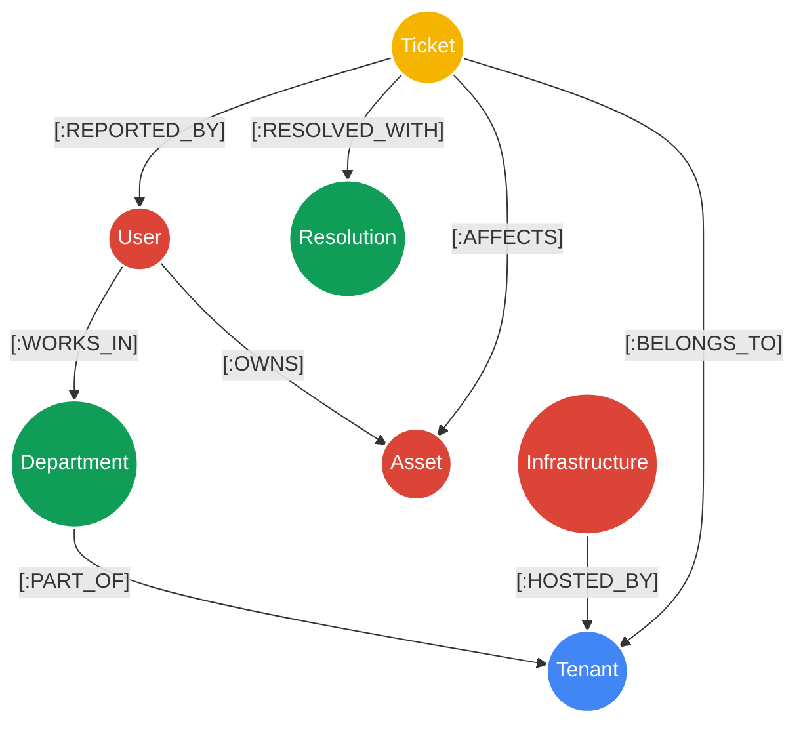

# Neo4j Graph RAG: Technical Deep Dive for PFE Defense

This document is designed to help you confidently answer any jury questions regarding the transition from standard vector RAG (`pgvector`) to **Agentic Graph RAG** using **Neo4j**.

---

## 1. Why Graph RAG over Vector RAG?

If the jury asks: *"Why did you migrate from PostgreSQL vectors to Neo4j?"*

**Your Answer:**
Standard vector databases like `pgvector` store data as "flat" semantic embeddings. They are great for finding similar text, but they have zero understanding of **relationships**. In an Enterprise IT environment, context is highly relational: A ticket is reported by a specific *User*, who owns a specific *Asset*, works in a specific *Department*, which belongs to a specific *Tenant*. 

Standard vector searches cannot filter safely by these relationships, leading to cross-tenant data leaks (e.g., Tenant A retrieving a highly similar but confidential ticket from Tenant B). **Neo4j solves this natively** by traversing mathematical edges, guaranteeing that our AI only accesses data explicitly linked to the sender's Tenant ID.

---

## 2. The Graph Data Model (Schema)

Our Neo4j database uses a highly structured property graph model. Here is the exact schema we built using Cypher:



### Nodes Explained:
1. **`Tenant`**: The root isolation node. (Properties: `id`, `name`, `domain`). 
2. **`User`**: The employee submitting the ticket. (Properties: `name`, `email`).
3. **`Department`**: Logical grouping of users. (Properties: `name`).
4. **`Asset`**: The physical/virtual device the user owns. (Properties: `tag`, `os`, `type`).
5. **`Infrastructure`**: Global servers for the tenant (e.g., Exchange, Active Directory).
6. **`Ticket`**: The historical incident. (Properties: `title`, `category`, `status`, `reported_at`).
7. **`Resolution`**: The step-by-step fix applied by IT. (Properties: `description`, `solved_by`).

---

## 3. How the Mock Data was Seeded

To prove the multi-tenant architecture, the Python script (`setup_neo4j_mock.py`) seeds the database with over 300 interconnected nodes and relationships spanning three distinct domains:
1. `m365x...onmicrosoft.com` (Target Client)
2. `contoso.com` (Fake Tenant A)
3. `fabrikam.com` (Fake Tenant B)

### The Cypher Seeding Query
When generating a historical ticket, we use a complex `MATCH` and `CREATE` Cypher query to wire all the nodes together in a single atomic transaction:

```cypher
// 1. Find the existing User, Department, Tenant, and Asset
MATCH (u:User {email: $email})-[:WORKS_IN]->(d:Department)-[:PART_OF]->(t:Tenant)
MATCH (u)-[:OWNS]->(a:Asset)

// 2. Create the new Ticket and Resolution nodes
CREATE (tic:Ticket {title: $title, category: $category, status: $status, reported_at: datetime()})
CREATE (res:Resolution {description: $resolution, solved_by: 'IT_Support_Agent'})

// 3. Draw the relationship edges (The Graph)
CREATE (tic)-[:REPORTED_BY]->(u)
CREATE (tic)-[:AFFECTS]->(a)
CREATE (tic)-[:RESOLVED_WITH]->(res)
CREATE (tic)-[:BELONGS_TO]->(t)
```

---

## 4. How Row-Level Security (RLS) Works

If the jury asks: *"How do you guarantee that the LLM doesn't hallucinate a Cypher query that accidentally exposes Contoso's tickets to Fabrikam?"*

**Your Answer:**
In our earlier iterations, we allowed the LangChain LLM to generate Cypher queries on the fly (Zero-Shot Text-to-Cypher). We discovered this was a massive security vulnerability because the LLM could easily ignore the tenant boundaries if prompted maliciously. 

To achieve **Zero-Trust Security**, we deprecated LLM-generated Cypher and transitioned to **Template-Based Graph RAG**. 

1. When the C# backend receives an email, it extracts the exact `SenderDomain`.
2. This domain is securely injected into the Python Orchestrator's environment context.
3. The Orchestrator forces the domain into a mathematically locked Cypher template:

```cypher
MATCH (tic:Ticket)-[:BELONGS_TO]->(t:Tenant {domain: $domain})
MATCH (tic)-[:RESOLVED_WITH]->(res:Resolution)
RETURN tic.title AS Issue, tic.category AS Category, res.description AS Solution
LIMIT 5
```

Because `$domain` is hardcoded at the backend level, the graph database engine physically cannot traverse edges belonging to another tenant. This completely solves the multi-tenant security problem while allowing the AI to safely read the returned historical tickets.

---

## 5. The "Contoso Secret" Test
To scientifically prove the security of the graph, we intentionally injected a highly confidential ticket into the database:
- **Tenant:** `contoso.com`
- **Title:** `CONFIDENTIAL: Project Apollo Source Code Leak`
- **Resolution:** `Revoked all Contoso developer GitHub PATs.`

Because the Graph RAG uses the `[:BELONGS_TO]` relationship tied explicitly to the sender's domain, a user emailing from the `m365x...` domain can ask *"What happened to Project Apollo?"* and the Neo4j engine will return absolute zero results, proving the isolation works flawlessly.


1. (Ticket)-[:BELONGS_TO]->(Tenant)
What it represents: Connects a historical support ticket directly to the client's company (Tenant).
Why it is crucial for retrieval: The Row-Level Security Lock.
Before looking at the ticket contents, the Neo4j database uses this relationship to isolate the search. If $domain is m365x..., the engine blocks any path that doesn't follow the [:BELONGS_TO] edge to the Target Client tenant.
Without this: The AI might fetch a highly similar VPN ticket from contoso.com and leak Contoso's network details.
2. (Ticket)-[:RESOLVED_WITH]->(Resolution)
What it represents: Connects the historical problem node to its verified technical fix (the resolution steps).
Why it is crucial for retrieval: The Payload Carrier.
When the Graph RAG finds a ticket with a matching title (e.g., "VPN Connection Drops"), it uses this relationship to immediately jump (hop) to the Resolution node to extract the exact steps (e.g., "Updated Cisco AnyConnect and flushed DNS").
Without this: The AI would only find that the problem occurred in the past, but would have no idea how it was actually fixed.
3. (Ticket)-[:AFFECTS]->(Asset)
What it represents: Links a historical ticket to the specific device (Laptop tag, Operating System) that was broken.
Why it is crucial for retrieval: OS & Hardware Compatibility Filtering.
If a user reports a "Blue Screen of Death" on Windows 11, the Graph RAG traces the [:AFFECTS] relationship to historical tickets to find solutions that specifically occurred on Windows 11 Laptops, ignoring fixes for macOS or Windows 10 which would be completely useless.
4. (User)-[:OWNS]->(Asset)
What it represents: Connects the employee to their assigned corporate laptop.
Why it is crucial for retrieval: Zero-Touch Device Identification.
When a client emails saying "My laptop is slow," they rarely provide their device serial number or operating system.
The Graph RAG takes the sender's email, walks the [:OWNS] relationship, and instantly discovers their device tag (e.g., LAPTOP-84920) and OS (e.g., Windows 11). It automatically adds this technical data to the Azure DevOps ticket so the engineer doesn't have to ask the client.
5. (Ticket)-[:REPORTED_BY]->(User)
What it represents: Connects a historical ticket to the specific employee who suffered the issue.
Why it is crucial for retrieval: Personal Recurrence Tracking.
Allows the system to check if this specific user has a history of repeating the same issue (e.g., John Doe locking himself out of his account three times this month). This helps the IT team identify if they need to train the user, rather than troubleshooting a system bug.
6. (Infrastructure)-[:HOSTED_BY]->(Tenant)
What it represents: Links global shared services (like Active Directory, the corporate Mail Server, or the VPN Gateway) to the Tenant.
Why it is crucial for retrieval: Global Outage Detection vs. Individual Device Issues.
If a user complains about VPN, the AI walks this link to see which VPN server (SRV-VPN-GW) is hosted by their tenant.
If 20 different users complain about VPN, the Graph RAG connects all 20 tickets to the same Infrastructure node. The system immediately alerts the engineer: "This is a global Cisco Gateway outage, not 20 broken laptops!"
7. (User)-[:WORKS_IN]->(Department)-[:PART_OF]->(Tenant)
What it represents: Connects an employee to their department (e.g., Finance, HR), which is part of the Tenant organization.
Why it is crucial for retrieval: Contextual Access and Permissions.
If a Finance employee complains about "Database Connection Errors", the system walks these edges to look at historical tickets reported by other Finance users regarding the Finance Database, ignoring engineering database tickets which use entirely different access permissions.