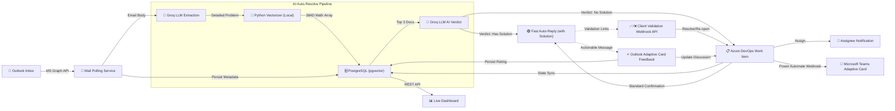

# 📧 Outlook → Azure DevOps Automation (with RAG Auto-Resolve)
## Comprehensive Project Documentation & Configuration Report

> [!NOTE]
> This document is designed to serve as the foundational documentation for a **Projet de Fin d'Études (PFE)** graduation report. It details every external service configuration, architecture decision, and system integration made throughout the project's lifecycle.

---

## 1. System Architecture

The automation pipeline connects multiple Microsoft Cloud services with local AI engines.



### High-Level Workflow Breakdown:
1. **Poll**: The service continuously monitors a shared Outlook mailbox via Microsoft Graph API.
2. **Analyze**: The Groq LLM (LLaMA-3 70B) parses the email to extract the core problem, severity, and IT Job Field.
3. **RAG Vector Search**: A local Python process converts the problem text into a mathematical vector array and searches a `pgvector` database of 14,000+ Microsoft Documentation chunks.
4. **Auto-Resolve Evaluation**: LLaMA-3 attempts to solve the user's issue strictly using the retrieved documentation. If a fix is found, an instant-fix email is sent.
5. **Azure DevOps & Routing**: If human intervention is required, an ADO Work Item is created and automatically assigned to the correct engineer based on the extracted Job Field (`departements.csv`).
6. **Notifications**: Teams Adaptive Cards and custom HTML emails are dispatched to both the client and the assigned engineer.
7. **Feedback Loop**: When an ADO ticket is closed, an Outlook Actionable Message is sent to the client, allowing them to submit a star rating directly inside their email client, which is then persisted to the database and ADO history.

---

## 2. Comprehensive Configuration Guide

This project relies on several external platforms. Below is the exact step-by-step documentation of how each service was configured.

### 2.1 Azure Active Directory (Entra ID) Configuration
To allow the .NET application to read and send emails without human interaction, a Daemon App Registration was required.

1. **App Registration**: Navigated to the Azure Portal -> Microsoft Entra ID -> App Registrations and created a new application.
2. **API Permissions**: Added the following **Application Permissions** (not Delegated) for the Microsoft Graph API:
   * `Mail.ReadWrite`
   * `Mail.Send`
3. **Admin Consent**: Clicked "Grant admin consent for [Organization]" to authorize the daemon app to access all tenant mailboxes.
   * *`[Insert Screenshot of Azure AD API Permissions showing Admin Consent Granted Here]`*
4. **Credentials Setup**: Generated a Client Secret to authenticate the application. 
   * Captured the `Tenant ID`, `Client ID`, and `Client Secret` for the `.NET User Secrets` configuration.

### 2.2 Azure DevOps Configuration
To allow the application to generate and modify Work Items, a Personal Access Token (PAT) was used.

1. **Organization & Project**: Identified the target Azure DevOps Organization URL and Project Name.
2. **PAT Generation**: Clicked User Settings -> Personal Access Tokens -> New Token.
3. **Scopes**: Selected the **Work Items: Read & Write** scope.
   * *`[Insert Screenshot of Azure DevOps PAT Creation Scope Screen Here]`*
4. **Customization (Optional)**: Ensured the target project was using an Agile or Basic process that supports the "Issue" or "Task" work item types.

### 2.3 Microsoft Teams Webhooks Configuration
To route notifications to specific department channels, Power Automate was used to generate Incoming Webhooks.

1. **Power Automate Workflow**: Created a new workflow: "Post to a channel when a webhook request is received".
2. **Channel Selection**: Configured the workflow to post an Adaptive Card to a specific Teams Channel (e.g., the IT Network team channel).
3. **URL Generation**: Saved the workflow and copied the generated HTTP POST URL.
   * *`[Insert Screenshot of Power Automate Webhook URL Configuration Here]`*
4. **CSV Mapping**: Pasted the URL into the `departements.csv` file under the `WebhookUrl` column corresponding to the specific IT Job Field.

### 2.4 Outlook Actionable Messages (Adaptive Cards) Configuration
To embed an interactive feedback form directly inside the closure email, the application was registered as a certified Actionable Message Provider.

1. **Developer Dashboard**: Navigated to [Actionable Email Developer Dashboard](https://outlook.office.com/connectors/oam/publish).
2. **Provider Creation**: Clicked "New Provider" and supplied the Sender Email Address (the support mailbox).
3. **Target URLs**: Left this field **blank** to allow the Adaptive Card to send HTTP POST requests to the dynamic Dev Tunnel URLs used during local development.
4. **Scope Selection**: Set the scope to **Test Users** and explicitly whitelisted the `test@...` email address to bypass the 15-minute organizational propagation delay and allow immediate testing.
   * *`[Insert Screenshot of Actionable Message Developer Dashboard Configuration Here]`*
5. **Originator ID**: Copied the generated `Provider ID` (Originator GUID) and injected it into the Adaptive Card JSON payload in the C# codebase.

### 2.5 PostgreSQL & Docker Configuration (pgvector)
The Retrieval-Augmented Generation (RAG) feature requires mathematical vector similarity searches, which standard databases cannot do. The `pgvector` extension was used.

1. **Docker Container Run**: Executed the following command to spin up a PostgreSQL instance with the `pgvector` extension pre-installed:
   ```bash
   docker run --name pgvector-db \
     -e POSTGRES_PASSWORD=secret \
     -p 5432:5432 \
     -d pgvector/pgvector:pg16
   ```
   * *`[Insert Screenshot of Docker Desktop showing the running pgvector container Here]`*

### 2.6 Python RAG Pipeline Configuration
A local Python environment acts as the embedding engine for the C# application.

1. **Virtual Environment Setup**:
   ```bash
   cd inetum-ms-kb
   python -m venv .venv
   .venv\Scripts\activate
   pip install sentence-transformers psycopg2-binary torch
   ```
2. **Model Selection**: Used HuggingFace's `all-MiniLM-L6-v2` model because it is lightweight, fast, and highly accurate for generating 384-dimensional vector arrays from English text.
3. **Knowledge Base Ingestion**: 
   * Ran the scraping scripts to extract Microsoft Documentation.
   * Ran `vectorize_docs.py` to chunk the HTML files, generate embeddings, and insert them into the `pgvector` database.

### 2.7 Microsoft Dev Tunnels Configuration
To allow Microsoft's external servers (for both Client Validation links and Adaptive Card feedback) to reach the local `.NET` application, a persistent Dev Tunnel was required.

1. **Persistent Tunnel Creation**:
   ```bash
   devtunnel create helpdesk -a
   devtunnel port create helpdesk -p 5000
   ```
2. **Tunnel Hosting**:
   ```bash
   devtunnel host helpdesk
   ```
   * *`[Insert Screenshot of Dev Tunnel terminal output showing the public URL Here]`*
3. **URL Integration**: The generated public URL (e.g., `https://19zfbm95-5000.uks1.devtunnels.ms`) was copied into the `appsettings.json` file under `BaseAppUrl` to ensure all emails dynamically generated valid webhook links.

---

## 3. Application Environment Setup (User Secrets)

To ensure sensitive credentials were not committed to source control, `.NET User Secrets` were utilized.

Run the following commands in the `MailListenerWorker` directory, replacing the placeholder values with the credentials gathered from Section 2:

```bash
# Azure AD Credentials
dotnet user-secrets set "AzureAd:TenantId" "YOUR_TENANT_ID"
dotnet user-secrets set "AzureAd:ClientId" "YOUR_CLIENT_ID"
dotnet user-secrets set "AzureAd:ClientSecret" "YOUR_CLIENT_SECRET"
dotnet user-secrets set "AzureAd:MailboxUser" "support@yourdomain.com"

# Azure DevOps Credentials
dotnet user-secrets set "AzureDevOps:OrganizationUrl" "https://dev.azure.com/YOUR_ORG"
dotnet user-secrets set "AzureDevOps:ProjectName" "YOUR_PROJECT"
dotnet user-secrets set "AzureDevOps:PatToken" "YOUR_PAT"

# Groq LLM
dotnet user-secrets set "Groq:ApiKey" "YOUR_GROQ_API_KEY"

# Database Configuration
dotnet user-secrets set "ConnectionStrings:DefaultConnection" "Host=localhost;Port=5432;Database=helpdesk_pipeline;Username=postgres;Password=secret"
```

---

## 4. Pipeline Execution & Testing Workflow

### 4.1 Initialization
Before running the application for the first time, apply the Entity Framework Core database migrations to create the required tables:
```bash
cd MailListenerWorker
dotnet ef database update
```

### 4.2 Running the Application
Ensure the Dev Tunnel and Docker containers are running, then launch the background service:
```bash
dotnet run
```
* *`[Insert Screenshot of terminal showing "Starting automation poll cycle..." Here]`*

### 4.3 End-to-End Testing Procedure
To validate the full architecture for the project report, the following workflow is executed:

1. **Trigger**: Send a test email from a client mailbox to the designated Support mailbox (e.g., "Urgent: Cannot access VPN").
2. **Analysis Phase**: The terminal logs indicate the LLM processing the email, identifying the "Network" job field.
3. **ADO Creation**: Check Azure DevOps to see the newly created Work Item. Ensure the Assignee matches the CSV mapping.
   * *`[Insert Screenshot of newly created Azure DevOps Work Item Here]`*
4. **Teams Alert**: Verify that the corresponding Microsoft Teams channel received the formatted Adaptive Card alert.
   * *`[Insert Screenshot of Microsoft Teams Adaptive Card Alert Here]`*
5. **Closure Phase**: Manually change the Work Item state to **Done** in Azure DevOps.
6. **Feedback Phase**: Within 60 seconds, the client mailbox receives a closure email containing an Outlook Actionable Message. 
7. **Validation**: Click "Submit Feedback" in the email. Ensure a `HTTP 200 OK` is logged in the terminal, and verify that the beautiful HTML feedback summary was successfully appended to the Azure DevOps Work Item discussion history.
   * *`[Insert Screenshot of Outlook Feedback Card Here]`*
   * *`[Insert Screenshot of Azure DevOps HTML Comment History Here]`*

---

## 5. Project Directory Structure

```text
PFE/
├── MailListenerWorker/                 # Main .NET Background Service Project
│   ├── Program.cs                      # Application Bootstrap & Minimal API
│   ├── MailPollingService.cs           # Core Logic: Email Polling, RAG, Teams Alerts
│   ├── AzureDevOpsService.cs           # Azure DevOps ADO item generation and mutation
│   ├── departements.csv                # Routing Table: Job Field → Email / Webhook URL
│   ├── Data/
│   │   └── AppDbContext.cs             # Entity Framework Core Database Context
│   ├── Models/
│   │   ├── JobFieldMapping.cs          # Routing data models
│   │   └── Ticket.cs                   # Core pipeline state model
│   ├── Services/
│   │   ├── GroqLlmService.cs           # LLM extraction & RAG Python bridge
│   │   └── JobFieldMappingService.cs   # CSV parser and fallback resolution
│   ├── Templates/
│   │   └── AutoReplyTemplate.html      # Responsive HTML email layouts
│   └── wwwroot/                        # Analytics Dashboard (Static SPA)
│
└── inetum-ms-kb/                       # Local Python RAG Knowledge Base Engine
    ├── .venv/                          # Virtual environment
    ├── src/
    │   ├── scrape/                     # Microsoft Docs scrapers
    │   ├── parse/                      # HTML -> Markdown cleaners
    │   └── embed/                      
    │       ├── vectorize_docs.py       # Embedding compiler for 14,000 files
    │       └── query_vector.py         # Sub-process bridge for C# similarity search
    └── config/                         # System configuration definitions
```
