# 📊 Project Diagrams — PFE Presentation

> All diagrams are in **Mermaid** format. You can render them in your PFE slides, in markdown viewers, or at [mermaid.live](https://mermaid.live).

---

## 📋 Recommended Presentation Order

| Order | Diagram | Purpose | When to Present |
|---|---|---|---|
| **1st** | 1. System Architecture | Show the big picture first | "Here's what the system looks like" |
| **2nd** | 7. Class Diagram | Explain the code structure | "Here are the main services" |
| **3rd** | 6. Database ER Diagram | Show the data model | "Here's how data is stored" |
| **4th** | 2.1 Pipeline Part 1 | Walk through email → AI analysis | "Step 1: An email arrives..." |
| **5th** | 2.2 Pipeline Part 2 | Walk through DB → ADO creation | "Step 2: We save and create the ticket..." |
| **6th** | 2.3 Pipeline Part 3 | Walk through notifications | "Step 3: We notify everyone..." |
| **7th** | 3. RAG Pipeline | Deep dive into the AI engine | "Now let me zoom into the RAG system..." |
| **8th** | 5. State Machine | Show all possible ticket states | "Here are all the states a ticket goes through" |
| **9th** | 4. ADO State Sync | Explain the sync loop | "How we keep everything in sync" |
| **10th** | 9. Client Validation | Show the accept/reject flow | "How the client interacts with AI solutions" |
| **11th** | 8.1 Sequence Part 1 | Show component interactions (creation) | "Here's the full interaction timeline" |
| **12th** | 8.2 Sequence Part 2 | Show component interactions (feedback) | "And here's what happens after..." |
| **13th** | 11. Error Handling | Show resilience design | "What happens when things go wrong" |
| **14th** | 10.1 + 10.2 Deployment | Dev vs Prod architecture | "And here's how we deploy it" |

---

## 1. System Architecture (Global Overview)

This is the big picture — all external services and how they connect.
Render at [plantuml.com](https://www.plantuml.com/plantuml/uml) or any PlantUML viewer.

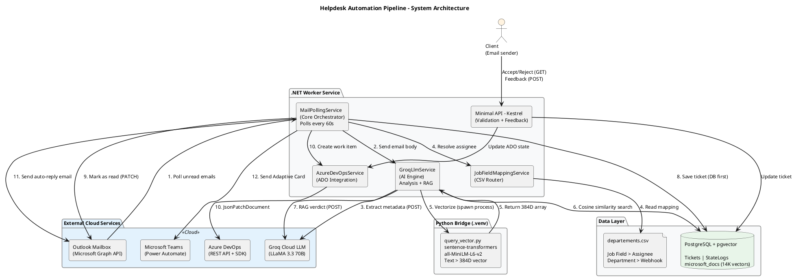

---

## 2. Email Processing Pipeline

The main pipeline is divided into **3 diagrams** for clarity.

### 2.1 Part 1 — Email Ingestion & AI Analysis (Steps 1–1.5)

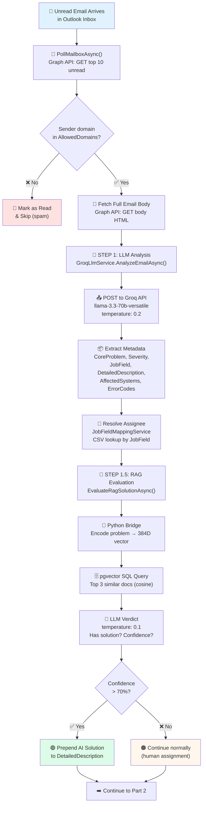

### 2.2 Part 2 — Database & Azure DevOps (Steps 2–4)

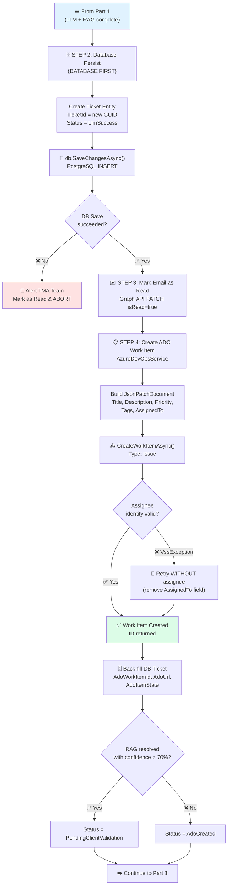

### 2.3 Part 3 — Notifications (Step 5)

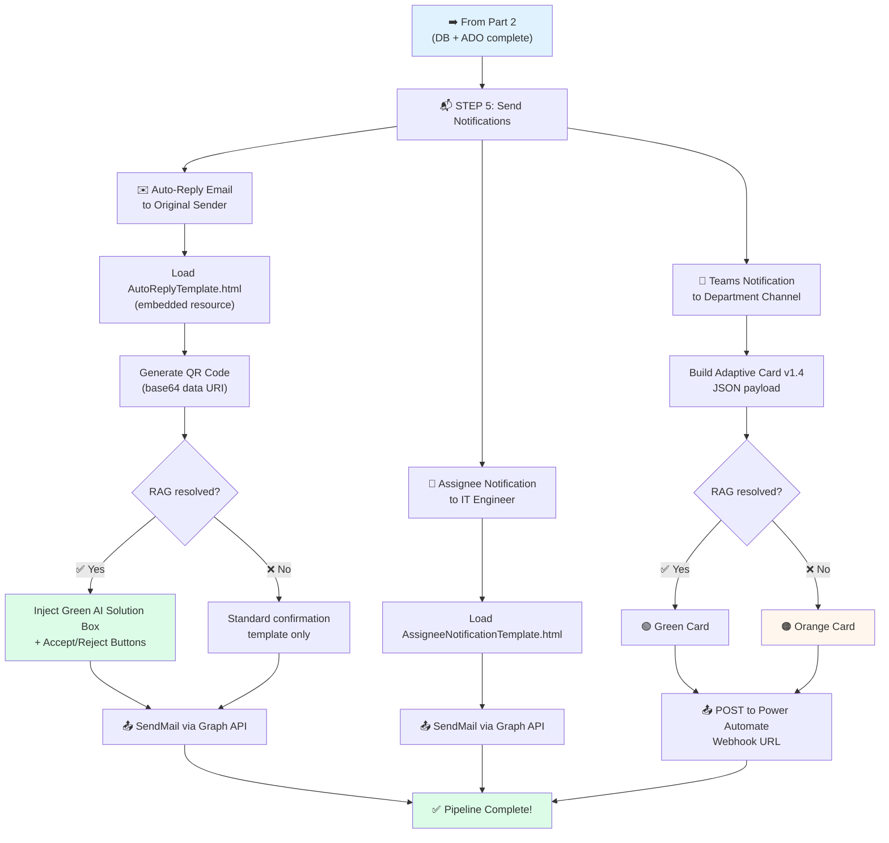

---

## 3. RAG Auto-Resolution Pipeline (Detailed)

Zoomed-in view of the 3-phase RAG system.

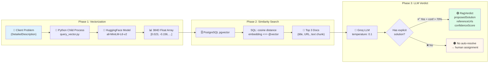

---

## 4. ADO State Synchronization Flow

How the worker keeps PostgreSQL in sync with Azure DevOps board changes.

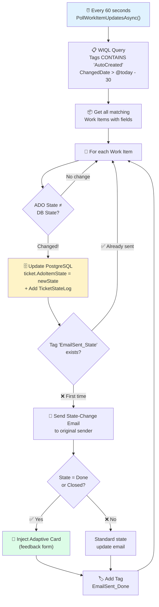

---

## 5. Pipeline State Machine

All possible states and transitions for a ticket.

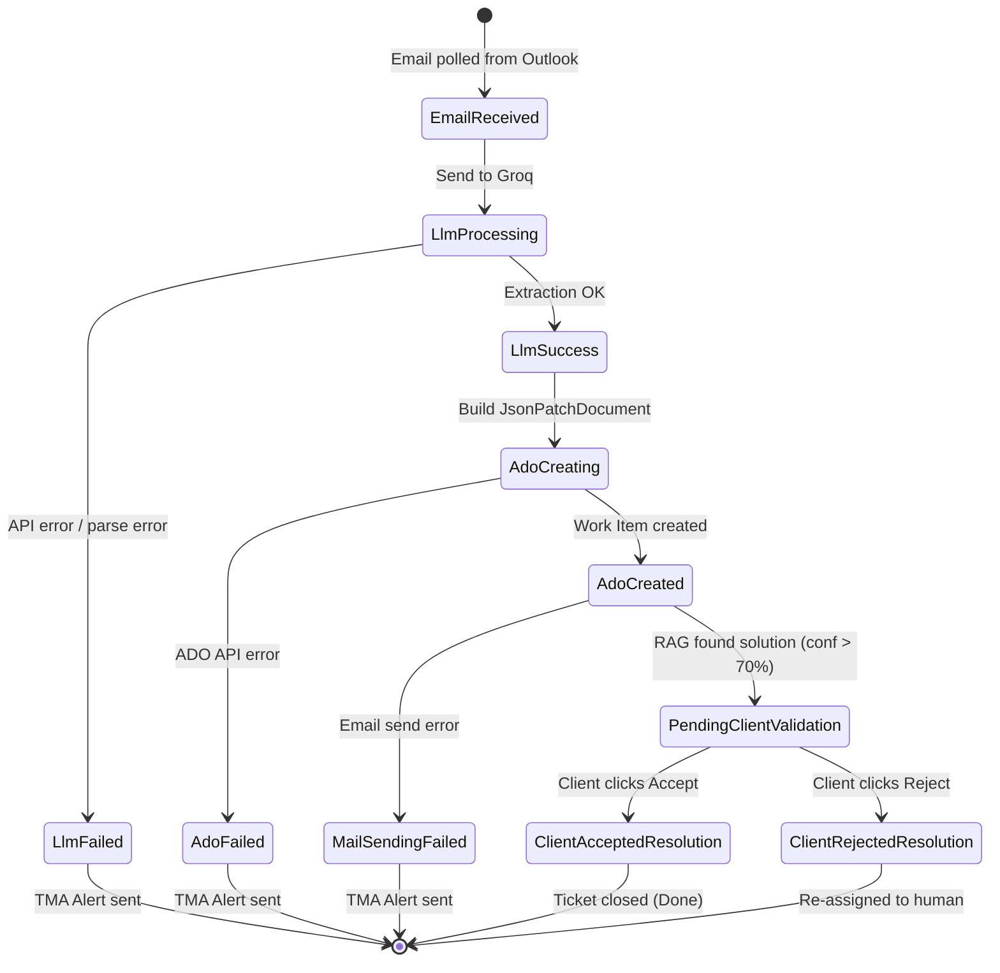

---

## 6. Database Entity-Relationship Diagram

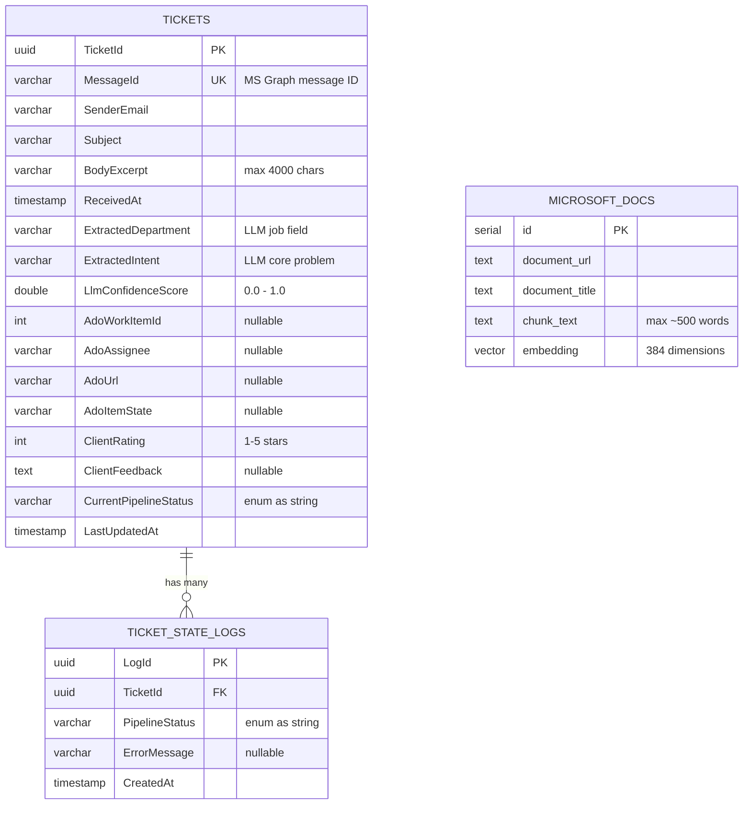

---

## 7. Class Diagram (Key Services)

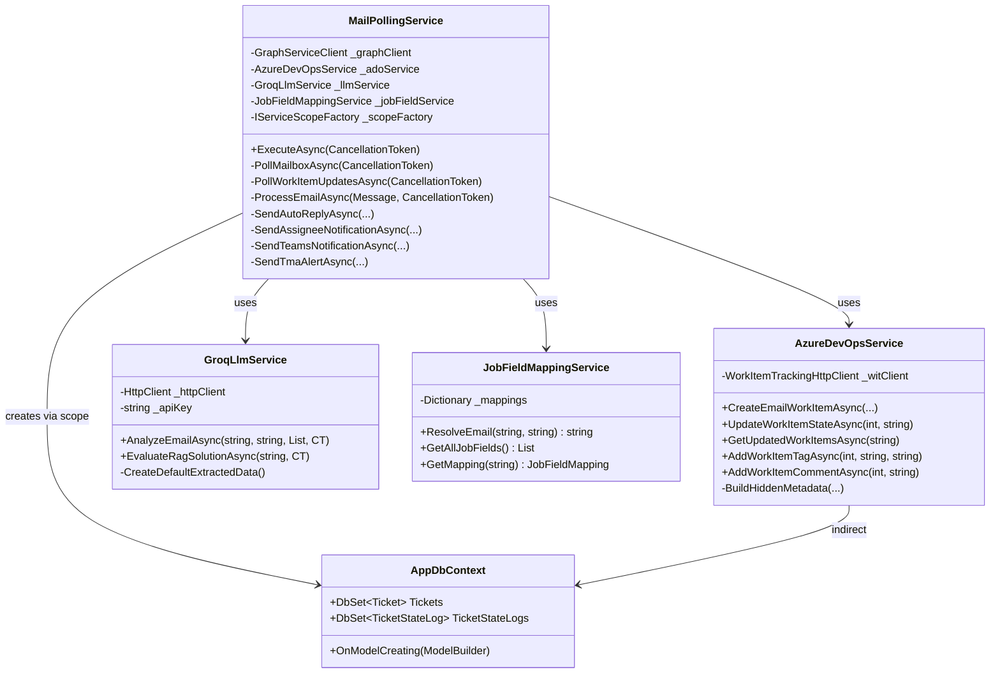

---

## 8. Sequence Diagram — Full Ticket Lifecycle

### 8.1 Part 1: Ticket Creation

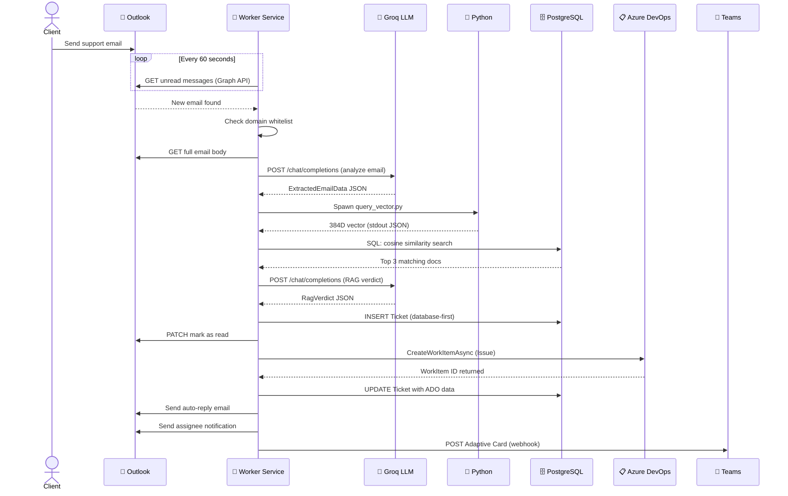

### 8.2 Part 2: State Sync & Client Feedback

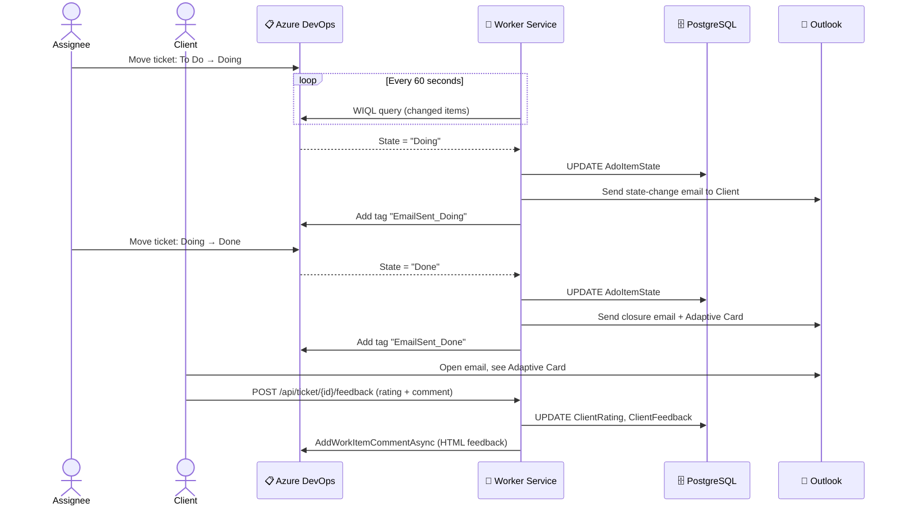

---

## 9. Client Validation Flow (RAG Accept/Reject)

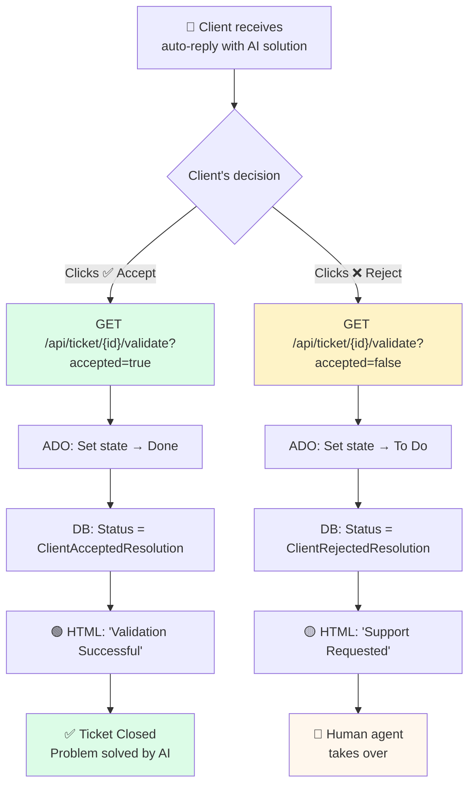

---

## 10. Deployment Architecture

### 10.1 Development (Current)

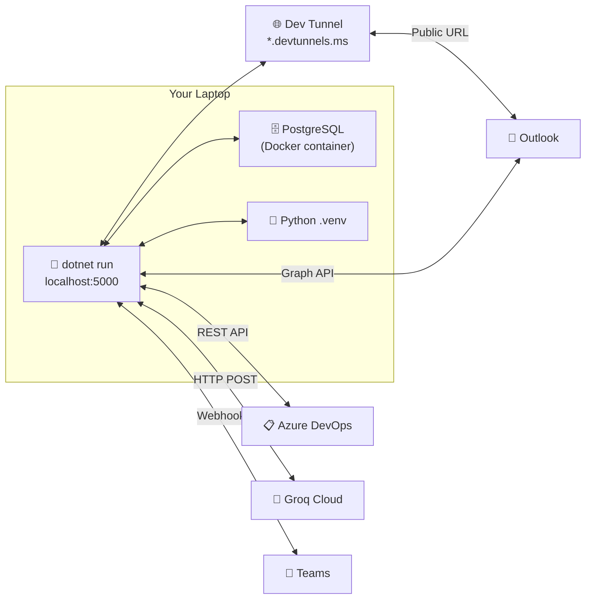

### 10.2 Production (Azure)

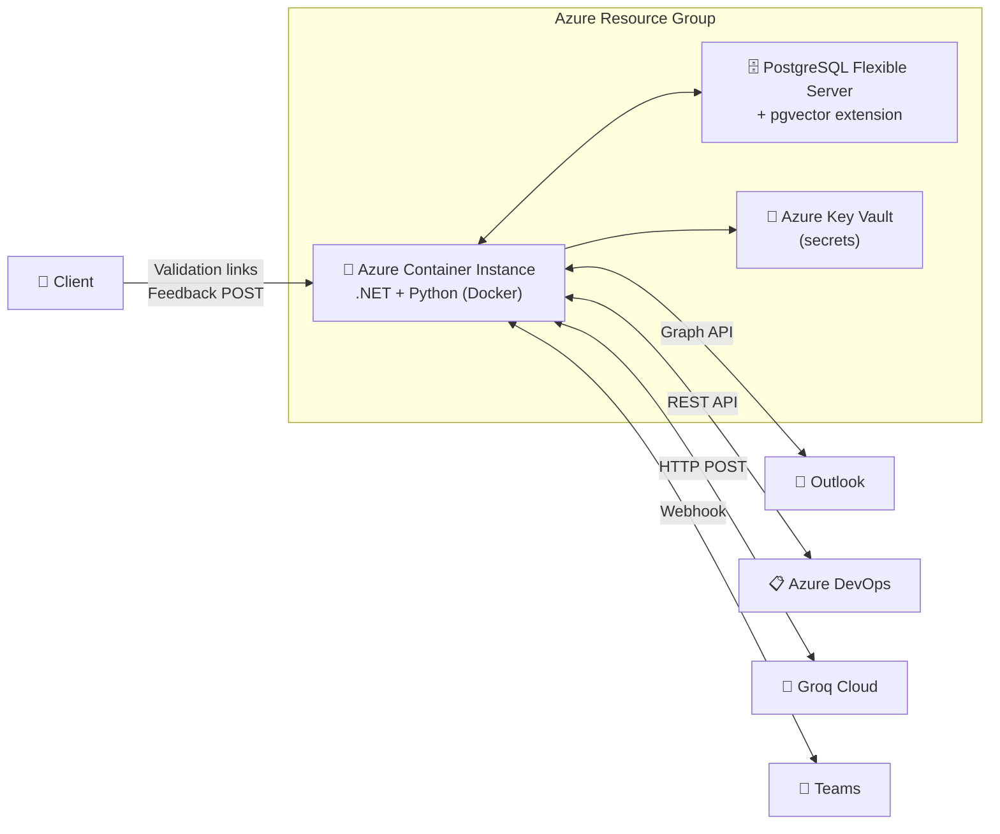

---

## 11. Error Handling Flow

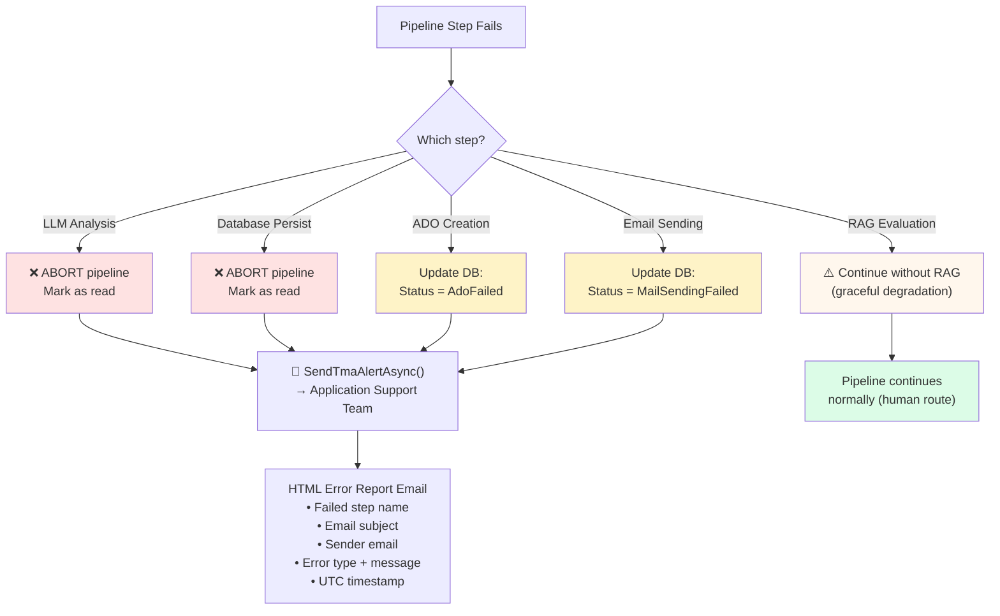
