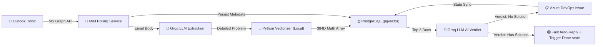

<p align="center">
  
  
  
  
  
  
  
</p>

# 📧 Outlook → Azure DevOps Automation (with RAG Auto-Resolve)

A **.NET Worker Service** that transforms incoming support emails into fully tracked Azure DevOps work items — powered by AI-driven analysis, intelligent routing, real-time state synchronization, and a custom **Retrieval-Augmented Generation (RAG)** engine for instantaneous ticket resolution.

---

## ⚡ How It Works



1. **Poll** — The worker service monitors a shared Outlook mailbox every 60 seconds via Microsoft Graph.
2. **Analyze** — Each new email is sent to **Groq LLM** (LLaMA 3.3 70B) which extracts: core problem, severity, estimated resolution time, and the responsible job field.
3. **RAG Vector Search** — A local Python script (using HuggingFace's `all-MiniLM-L6-v2`) converts the problem into a mathematical 384D vector array. C# queries PostgreSQL (`pgvector`) to find the **top 3 matching Microsoft Documentation chunks** from an offline dataset of 14,000+ scraped files.
4. **Auto-Resolve Evaluation** — Llama-3 evaluates the problem natively against these 3 official Microsoft Docs. If it finds an explicit, step-by-step solution, it dynamically generates an Instant Fix email.
5. **Route & Create** — An Azure DevOps **Issue** work item is created. If the RAG AI resolved it, the step-by-step solution is heavily appended to the Azure DevOps ticket description tracking logs!
6. **Notify** — A professional HTML auto-reply (with QR code) is sent. If auto-resolved, this email contains a massive green highlighted box with the exact solution and Microsoft URLs.
7. **Track & Sync** — Every ticket and state transition is persisted to PostgreSQL. A live web dashboard shows real-time pipeline stats and tracks Azure DevOps board state changes natively to send automatic user updates!

---

## ✅ Features

| Feature | Description |
|---|---|
| 🤖 **AI Email Analysis** | Groq LLM extracts problem, severity, department, and resolution estimate |
| 🧠 **Local RAG Vector Engine** | Offline, quota-free vector similarity search using PostgreSQL `pgvector` |
| ⚡ **AI Auto-Resolution** | Instantly solves level-1 issues by citing official knowledge base documents |
| 📋 **Auto Work Item Creation** | Creates Azure DevOps Issues with priority, assignee, and metadata |
| 🔀 **Intelligent Routing** | CSV-based job field → assignee mapping with fallback defaults |
| 📬 **Auto-Reply Emails** | Professional HTML emails with ticket reference, QR codes, and injected AI solutions |
| 👤 **Assignee Notifications** | Dedicated email notifications to the assigned team member |
| 🔄 **State Sync** | Polls ADO board and sends status update emails on human state changes |
| 🗄️ **Full Audit Trail** | PostgreSQL database tracks every ticket and state transition |
| 🛡️ **Graceful Fallback** | If the AI is unsure, the ticket safely generates as normal for a human agent |

---

## 🛠️ Tech Stack

- **Runtime**: .NET 10.0 (Web SDK) + Python 3 (Virtual Environment)
- **Vector Search Engine**: `sentence-transformers` (`all-MiniLM-L6-v2`) + Python `requests`
- **Email Integration**: Microsoft Graph SDK v5
- **Work Items**: Azure DevOps REST API (`Microsoft.TeamFoundationServer.Client`)
- **AI/LLM**: Groq API (LLaMA 3.3 70B Versatile)
- **Database**: PostgreSQL with `pgvector` Plugin + Entity Framework Core 8
- **Auth**: Azure AD Client Credentials (`Azure.Identity`)
- **Frontend**: Vanilla HTML/CSS/JS dashboard (served via Kestrel static files)

---

## 📋 Prerequisites

| Requirement | Details |
|---|---|
| **.NET 10.0 SDK** | [Download](https://dotnet.microsoft.com/download) |
| **Python 3+** | Create `.venv` and install `sentence-transformers`, `torch`, `psycopg2` | 
| **Azure AD App Registration** | With `Mail.Read`, `Mail.Send` application permissions (admin-consented) |
| **Azure DevOps** | Organization + Project + PAT token with Work Items read/write |
| **Groq API Key** | Free tier at [console.groq.com](https://console.groq.com) |
| **PostgreSQL + pgvector** | `docker run --name my-postgres -e POSTGRES_PASSWORD=secret -d -p 5432:5432 postgres:16` and manually compile `pgvector` inside. |

---

## ⚙️ Configuration (User Secrets)

```bash
cd MailListenerWorker

# Azure AD
dotnet user-secrets set "AzureAd:TenantId"     "YOUR_TENANT_ID"
dotnet user-secrets set "AzureAd:ClientId"      "YOUR_CLIENT_ID"
dotnet user-secrets set "AzureAd:ClientSecret"   "YOUR_CLIENT_SECRET"
dotnet user-secrets set "AzureAd:MailboxUser"     "support@yourdomain.com"

# Azure DevOps
dotnet user-secrets set "AzureDevOps:OrganizationUrl"  "https://dev.azure.com/YOUR_ORG"
dotnet user-secrets set "AzureDevOps:ProjectName"       "YOUR_PROJECT"
dotnet user-secrets set "AzureDevOps:PatToken"           "YOUR_PAT"

# Groq LLM
dotnet user-secrets set "Groq:ApiKey"  "YOUR_GROQ_API_KEY"

# PostgreSQL (Must have pgvector installed!)
dotnet user-secrets set "ConnectionStrings:DefaultConnection" "Host=localhost;Port=5432;Database=helpdesk_pipeline;Username=postgres;Password=YOUR_PASSWORD"
```

---

## 🚀 Run

```bash
# 1. Apply database migrations
cd MailListenerWorker
dotnet ef database update

# 2. Run the background automation service!
dotnet run --project MailListenerWorker
```

---

## 📁 Project Structure

```text
PFE/
├── MailListenerWorker/
│   ├── Program.cs                     # DI setup, app bootstrap
│   ├── MailPollingService.cs           # Background worker: Email polling, ADO sync, RAG Injection
│   ├── AzureDevOpsService.cs           # Azure DevOps ADO item generation and mutation
│   ├── Data/
│   │   └── AppDbContext.cs             # EF Core DbContext 
│   ├── Services/
│   │   ├── GroqLlmService.cs           # Groq LLM integration + RAG Vectorization Pipeline
│   │   └── JobFieldMappingService.cs   # CSV-based intent handling
│   ├── Templates/
│   │   └── AutoReplyTemplate.html      # RAG-Injection-enabled HTML design
│   └── wwwroot/                        # Live dashboard (static SPA)
│
└── inetum-ms-kb/                       # AI Knowledge Base Scraper Engine
    ├── .venv/                          # Python environments
    ├── src/
    │   ├── scrape/                     # Microsoft Docs XML sitemap scrapers
    │   ├── parse/                      # HTML to Markdown DOM cleaners
    │   └── embed/                      
    │       ├── vectorize_docs.py       # Batch PGVector Embedding compiler for 14,000 files
    │       ├── query_vector.py         # Sub-process Python bridge for C# Worker
    │       └── test_rag.py             # Mock test-suite for NLP Verdict engine
    └── config/                         # Data paths
```

---

## 🗺️ Roadmap

- [x] **RAG Integration** — Retrieval-Augmented Generation using a local `pgvector` database to instantly auto-answer client questions with 100% safe guardrails.
- [ ] **CI/CD Pipeline** — Azure DevOps pipeline for automated build, test, and deployment
- [ ] **Microsoft Teams Notifications** — Adaptive card messages to assigned team members via webhook
- [x] **Enhanced Error Routing** — Fallback mechanism for pipeline failures alerting the TMA Support Team.
- [ ] **Advanced Email Handling** — Support for email threads, inline images, and large attachments.