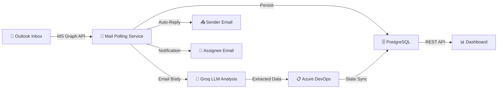

<p align="center">
  
  
  
  
  
</p>

# 📧 Outlook → Azure DevOps Automation

A **.NET Worker Service** that transforms incoming support emails into fully tracked Azure DevOps work items — powered by AI-driven analysis, intelligent routing, and real-time state synchronization.

---

## ⚡ How It Works



1. **Poll** — The worker service monitors a shared Outlook mailbox every 60 seconds via Microsoft Graph.
2. **Analyze** — Each new email is sent to **Groq LLM** (LLaMA 3.3 70B) which extracts: core problem, severity, estimated resolution time, and the responsible job field.
3. **Route** — The extracted job field is matched against a CSV mapping file to find the correct assignee.
4. **Create** — An Azure DevOps **Issue** work item is created with the extracted data, priority, and assignee.
5. **Notify** — A professional HTML auto-reply (with QR code) is sent to the sender, and a separate notification goes to the assignee.
6. **Track** — Every ticket and state transition is persisted to PostgreSQL. A live web dashboard shows real-time pipeline stats.
7. **Sync** — The worker polls Azure DevOps for state changes and sends status update emails when tickets move through the board.

---

## ✅ Features

| Feature | Description |
|---|---|
| 🤖 **AI Email Analysis** | Groq LLM extracts problem, severity, department, and resolution estimate |
| 📋 **Auto Work Item Creation** | Creates Azure DevOps Issues with priority, assignee, and metadata |
| 🔀 **Intelligent Routing** | CSV-based job field → assignee mapping with fallback defaults |
| 📬 **Auto-Reply Emails** | Professional HTML emails with ticket reference and QR code |
| 👤 **Assignee Notifications** | Dedicated email notifications to the assigned team member |
| 🔄 **State Sync** | Polls ADO board and sends status update emails on state changes |
| 🗄️ **Full Audit Trail** | PostgreSQL database tracks every ticket and state transition |
| 📊 **Live Dashboard** | Real-time web UI showing pipeline stats and ticket history |
| 🛡️ **Graceful Fallback** | If LLM fails, tickets still get created with defaults |

---

## 🛠️ Tech Stack

- **Runtime**: .NET 10.0 (Web SDK)
- **Email Integration**: Microsoft Graph SDK v5
- **Work Items**: Azure DevOps REST API (via `Microsoft.TeamFoundationServer.Client`)
- **AI/LLM**: Groq API (LLaMA 3.3 70B Versatile)
- **Database**: PostgreSQL via Entity Framework Core 8 + Npgsql
- **Auth**: Azure AD Client Credentials (`Azure.Identity`)
- **Frontend**: Vanilla HTML/CSS/JS dashboard (served via Kestrel static files)

---

## 📋 Prerequisites

| Requirement | Details |
|---|---|
| **.NET 10.0 SDK** | [Download](https://dotnet.microsoft.com/download) |
| **Azure AD App Registration** | With `Mail.Read`, `Mail.Send` application permissions (admin-consented) |
| **Azure DevOps** | Organization + Project + PAT token with Work Items read/write |
| **Groq API Key** | Free tier at [console.groq.com](https://console.groq.com) |
| **PostgreSQL** | Local or Docker: `docker run -d -p 5432:5432 -e POSTGRES_PASSWORD=mysecretpassword postgres` |

---

## ⚙️ Configuration

### Option A — User Secrets (Recommended)

```bash
cd MailListenerWorker

# Azure AD
dotnet user-secrets set "AzureAd:TenantId"     "YOUR_TENANT_ID"
dotnet user-secrets set "AzureAd:ClientId"      "YOUR_CLIENT_ID"
dotnet user-secrets set "AzureAd:ClientSecret"   "YOUR_CLIENT_SECRET"
dotnet user-secrets set "AzureAd:MailboxUser"     "support@yourdomain.com"

# Azure DevOps
dotnet user-secrets set "AzureDevOps:OrganizationUrl"  "https://dev.azure.com/YOUR_ORG"
dotnet user-secrets set "AzureDevOps:ProjectName"       "YOUR_PROJECT"
dotnet user-secrets set "AzureDevOps:PatToken"           "YOUR_PAT"

# Groq LLM
dotnet user-secrets set "Groq:ApiKey"  "YOUR_GROQ_API_KEY"

# PostgreSQL
dotnet user-secrets set "ConnectionStrings:DefaultConnection" "Host=localhost;Port=5432;Database=helpdesk_pipeline;Username=postgres;Password=YOUR_PASSWORD"

# Job Field CSV
dotnet user-secrets set "JobFieldCsv:Path"             "departements.csv"
dotnet user-secrets set "JobFieldCsv:DefaultAssignee"   "support@yourdomain.com"
```

### Option B — appsettings.json

Edit `MailListenerWorker/appsettings.json` directly. **Do NOT commit secrets.**

### Job Field CSV

Place a `departements.csv` file in the `MailListenerWorker/` directory with this format:

```csv
Job field,User principal name,Department
Administrator,admin@yourdomain.com,IT
Database – Oracle,oracle.admin@yourdomain.com,Data
Network,network.ops@yourdomain.com,Infrastructure
```

---

## 🚀 Run

```bash
# 1. Apply database migrations
cd MailListenerWorker
dotnet ef database update

# 2. Run the service
dotnet run --project MailListenerWorker
```

The dashboard is available at **http://localhost:5000** (or the configured port).

---

## 📁 Project Structure

```
PFE/
├── .gitignore
├── PFE.sln
├── README.md
└── MailListenerWorker/
    ├── Program.cs                     # DI setup, Minimal API endpoints, app bootstrap
    ├── MailPollingService.cs           # Background worker: email polling + ADO state sync
    ├── AzureDevOpsService.cs           # Azure DevOps work item CRUD operations
    ├── appsettings.json                # Config template (no secrets committed)
    ├── MailListenerWorker.csproj        # Project file & NuGet dependencies
    │
    ├── Data/
    │   └── AppDbContext.cs             # EF Core DbContext with Fluent API configuration
    │
    ├── Models/
    │   ├── Enums/
    │   │   └── PipelineStatus.cs       # Pipeline lifecycle states enum
    │   ├── Ticket.cs                   # Core ticket entity (email → ADO mapping)
    │   ├── TicketStateLog.cs           # Immutable audit log for state transitions
    │   ├── ExtractedEmailData.cs       # LLM extraction result DTO
    │   └── JobFieldMapping.cs          # CSV row DTO (job field → email)
    │
    ├── Services/
    │   ├── GroqLlmService.cs           # Groq/LLaMA LLM integration
    │   └── JobFieldMappingService.cs   # CSV-based job field → assignee resolution
    │
    ├── Utilities/
    │   └── QrCodeGenerator.cs          # QR code generation for email templates
    │
    ├── Templates/
    │   ├── AutoReplyTemplate.html      # HTML auto-reply to email sender
    │   └── AssigneeNotificationTemplate.html  # HTML notification to assignee
    │
    ├── Migrations/                     # EF Core database migrations
    ├── Properties/
    │   └── launchSettings.json
    └── wwwroot/                        # Live dashboard (static SPA)
        ├── index.html
        ├── style.css
        └── app.js
```

---

## 🗺️ Roadmap

- [ ] **RAG Integration** — Retrieval-Augmented Generation using a vector database of company knowledge to auto-answer common questions
- [ ] **CI/CD Pipeline** — Azure DevOps pipeline for automated build, test, and deployment
- [ ] **Microsoft Teams Notifications** — Adaptive card messages to assigned team members via webhook
- [ ] **Enhanced Error Routing** — Fallback mechanism for pipeline failures (LLM timeout, ADO API errors)
- [ ] **Advanced Email Handling** — Support for email threads, inline images, and large attachments

---

## 🔐 Security

- **Never commit secrets** — Use [.NET User Secrets](https://learn.microsoft.com/en-us/aspnet/core/security/app-secrets) locally or Azure Key Vault in production
- **CSV files are gitignored** — `departements.csv` contains real employee email addresses
- **Azure AD uses client credentials** — No interactive user login required
- **API keys** (Groq, ADO PAT) should be rotated regularly