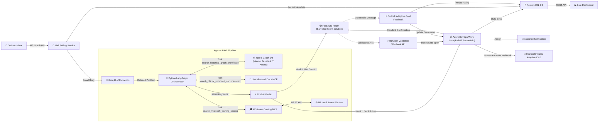

<p align="center">
  
  
  
  
  
  
  
  
</p>

# 📧 Outlook → Azure DevOps Automation (with Agentic RAG Auto-Resolve)

A **.NET Worker Service** that transforms incoming support emails into fully tracked Azure DevOps work items — powered by AI-driven analysis, intelligent routing, real-time state synchronization, a custom **Agentic RAG** engine for instantaneous ticket resolution, and **conversation-aware thread tracking** that prevents duplicate tickets and keeps all communication within a single Outlook thread.

---

## ⚡ How It Works



1. **Poll** — The worker service natively monitors a shared support Outlook mailbox every 60 seconds via the Microsoft Graph API.
2. **Analyze** — Each new email is sent to **Groq LLM** (LLaMA 3.3 70B) which safely extracts the abstract metadata: core problem, severity, estimated resolution time, and the relevant IT Job Field.
3. **Agentic RAG Orchestrator** — The C# worker passes the problem to a Python-based **LangGraph Agentic Orchestrator**. The Agent evaluates the request and autonomously decides which of its three tools to invoke.
4. **Zero-Touch IT Reconnaissance** — At startup, the pipeline dynamically queries a **Neo4j Graph Database** using the sender's email domain to resolve their Name, Department, active corporate Asset Tag, OS Version, support ticket history risk, and tenant-hosted servers/gateways (Exchange, Active Directory, Oracle, VPN).
5. **Three-Tool Execution** — The Orchestrator routes the problem to:
   - **Internal KB**: Performs a Cypher lookup against Neo4j (`search_historical_graph_knowledge`) to query past resolution logs.
   - **Live Microsoft MCP**: A custom HTTP wrapper that connects to the official Microsoft MCP Server to fetch real-time, up-to-date Microsoft documentation.
   - **Custom Catalog MCP**: Communicates via standard MCP to fetch official Microsoft trainings, learning paths, and exams via Entra ID App-Only access.
6. **Route & Create** — Based on the retrieved data, the Agent synthesizes a final JSON `RagVerdict`. An Azure DevOps **Issue** work item is created containing the full **IT Reconnaissance** block (laptop tags, server gateways) in the description for the IT Engineer.
7. **Client Telemetry Sanitization** — Before sending the professional HTML auto-reply to the client, a C# line-skipping parser **automatically strips out** internal corporate metadata (gateways, laptops, ticket history) to prevent security leaks, ensuring the end-client only receives clean Microsoft-approved steps.
8. **Threaded Auto-Reply** — The HTML response is sent using Microsoft Graph's `.Reply` endpoint, ensuring all communication remains strictly **inside the same Outlook thread**.
9. **Teams Alert** — An **Adaptive Card** is fired to the correct Microsoft Teams channel displaying ticket details, priority, and a direct ADO link — color-coded 🟢 green for RAG-resolved or 🟠 orange for human-assigned tickets.
10. **Thread Tracking & Sync** — Follow-up replies to the bot are detected via `ConversationId`. The Groq LLM summarizes the reply and appends it as a styled comment to the ADO Work Item — **no duplicate ticket created**.
11. **Interactive Feedback** — Star rating (1-5) and feedback forms are embedded directly in closure emails as **Outlook Actionable Messages (Adaptive Cards)**, persisting ratings in PostgreSQL and sync'ing them to the ADO discussion board.

---

## ✅ Features

| Feature | Description |
|---|---|
| 🤖 **AI Email Analysis** | Groq LLM extracts problem, severity, department, and resolution estimate |
| 🕸️ **Neo4j Graph RAG** | Explores complex relationships between Tenants, Users, IT Assets, and Past Support Tickets |
| 🛡️ **Zero-Touch IT Recon** | Dynamic pre-resolution telemetry mapping users to active laptops, OS versions, and organization gateways |
| 🔒 **Backend-Enforced RLS** | Strictly isolates multi-tenant data using Cypher parameters matching the sender's verified email domain |
| 🫧 **Client Telemetry Sanitizer** | Smart line-skipping C# parser that filters out internal server topology/asset tags before emailing clients |
| 🧠 **LangGraph Orchestrator** | Multi-tool ReAct agent utilizing standard LangChain structures for dynamic, real-time routing |
| 🔌 **Model Context Protocol (MCP)** | Stdio and HTTP-based MCP servers exposing live Microsoft documentation and catalogs to the agent |
| ⚡ **AI Auto-Resolution** | Instantly solves level-1 issues by citing official docs and live MS Learn modules |
| 📋 **Auto Work Item Creation** | Creates Azure DevOps Issues with priority, assignee, and metadata |
| 🔀 **Intelligent Routing** | CSV-based job field → assignee mapping with fallback defaults |
| 🔗 **Client Validation Workflow** | Generates dynamic REST callbacks allowing clients to accept or reject AI resolutions |
| 💬 **Microsoft Teams Alerts** | Fires Adaptive Cards to the correct Teams channel via Power Automate Webhooks, color-coded by RAG outcome |
| 📬 **Threaded Auto-Reply Emails** | Professional HTML emails sent via `.Reply` to stay in the same Outlook conversation thread |
| 📎 **Attachment Handling** | Inline images embedded in ADO comments; file attachments uploaded and linked to Work Items |
| 🔗 **ConversationId Thread Tracking** | Detects follow-up replies and appends LLM-summarized comments instead of creating duplicates |
| 👤 **Assignee Notifications** | Dedicated email notifications to the assigned team member |
| 🔄 **State Sync** | Polls ADO board and sends status update emails as replies in the original thread |
| 🗄️ **Full Audit Trail** | PostgreSQL database tracks every ticket and state transition |
| ⭐ **Outlook Actionable Messages** | In-email Adaptive Card feedback forms synced directly to Azure DevOps history |

---

## 🛠️ Tech Stack

- **Runtime**: .NET 10.0 (Web SDK) + Python 3 (Virtual Environment)
- **Agentic Framework**: LangChain / LangGraph + Model Context Protocol (MCP) SDK
- **Graph Database**: Neo4j Graph DB (Multi-Tenant Graph RAG + IT Asset Mapping)
- **Email Integration**: Microsoft Graph SDK v5
- **Teams Integration**: Power Automate Webhooks (Adaptive Cards v1.4 via `HttpClient`)
- **Work Items**: Azure DevOps REST API (`Microsoft.TeamFoundationServer.Client`)
- **AI/LLM**: Groq API (LLaMA 3.3 70B Versatile)
- **Relational Audit DB**: PostgreSQL + Entity Framework Core 8
- **Auth**: Azure AD Client Credentials (`Azure.Identity`)
- **Frontend**: Vanilla HTML/CSS/JS dashboard (served via Kestrel static files)

---

## 📋 Prerequisites

| Requirement | Details |
|---|---|
| **.NET 10.0 SDK** | [Download](https://dotnet.microsoft.com/download) |
| **Python 3+** | Create `.venv` and install `sentence-transformers`, `torch`, `psycopg2` | 
| **Azure AD App Registration** | With `Mail.Read`, `Mail.Send` application permissions (admin-consented) |
| **Azure DevOps** | Organization + Project + PAT token with Work Items read/write |
| **Groq API Key** | Free tier at [console.groq.com](https://console.groq.com) |
| **PostgreSQL + pgvector** | `docker run --name my-postgres -e POSTGRES_PASSWORD=secret -d -p 5432:5432 postgres:16` and manually compile `pgvector` inside. |
| **Microsoft Teams** | Create a Power Automate Workflow ("Post alert to Teams channel via webhook") per department channel and paste each generated URL in `departements.csv` under the `WebhookUrl` column. |

---

## ⚙️ Configuration (User Secrets)

```bash
cd MailListenerWorker

# Azure AD
dotnet user-secrets set "AzureAd:TenantId"     "YOUR_TENANT_ID"
dotnet user-secrets set "AzureAd:ClientId"      "YOUR_CLIENT_ID"
dotnet user-secrets set "AzureAd:ClientSecret"   "YOUR_CLIENT_SECRET"
dotnet user-secrets set "AzureAd:MailboxUser"     "support@yourdomain.com"

# Azure DevOps
dotnet user-secrets set "AzureDevOps:OrganizationUrl"  "https://dev.azure.com/YOUR_ORG"
dotnet user-secrets set "AzureDevOps:ProjectName"       "YOUR_PROJECT"
dotnet user-secrets set "AzureDevOps:PatToken"           "YOUR_PAT"

# Groq LLM
dotnet user-secrets set "Groq:ApiKey"  "YOUR_GROQ_API_KEY"

# Application Settings
dotnet user-secrets set "Email:BaseAppUrl" "http://localhost:5000"

# PostgreSQL (Must have pgvector installed!)
dotnet user-secrets set "ConnectionStrings:DefaultConnection" "Host=localhost;Port=5432;Database=helpdesk_pipeline;Username=postgres;Password=YOUR_PASSWORD"
```

---

## 🚀 Run

```bash
# 1. Apply database migrations
cd MailListenerWorker
dotnet ef database update

# 2. Run the background automation service!
dotnet run --project MailListenerWorker
```

---

## 📁 Project Structure

```text
PFE/
├── MailListenerWorker/
│   ├── Program.cs                     # DI setup, app bootstrap + Minimal API (Client Validation)
│   ├── MailPollingService.cs           # Background worker: Email polling, ADO sync, RAG, Teams Alerts
│   ├── AzureDevOpsService.cs           # Azure DevOps ADO item generation and mutation
│   ├── departements.csv               # Job Field → Email, Department, WebhookUrl routing table
│   ├── Data/
│   │   └── AppDbContext.cs             # EF Core DbContext 
│   ├── Models/
│   │   ├── JobFieldMapping.cs          # Job field entity (Email, TeamId, ChannelId, WebhookUrl)
│   │   └── Enums/PipelineStatus.cs     # Full pipeline state machine
│   ├── Services/
│   │   ├── GroqLlmService.cs           # Groq LLM integration + RAG Vectorization Pipeline
│   │   └── JobFieldMappingService.cs   # CSV-based department routing + Webhook URL resolution
│   ├── Templates/
│   │   └── AutoReplyTemplate.html      # RAG-Injection-enabled HTML design
│   └── wwwroot/                        # Live dashboard (static SPA)
│
└── inetum-ms-kb/                       # AI Knowledge Base Scraper Engine
    ├── .venv/                          # Python environments
    ├── src/
    │   ├── scrape/                     # Microsoft Docs XML sitemap scrapers
    │   ├── parse/                      # HTML to Markdown DOM cleaners
    │   └── embed/                      
    │       ├── vectorize_docs.py       # Batch PGVector Embedding compiler for 14,000 files
    │       ├── query_vector.py         # Sub-process Python bridge for C# Worker
    │       └── test_rag.py             # Mock test-suite for NLP Verdict engine
    └── config/                         # Data paths
```

---

## 🗺️ Roadmap (Chronological Build Order)

### Phase 1 — Foundation & Core Infrastructure
- [x] **Project Scaffolding** — .NET Worker Service project creation with `Microsoft.NET.Sdk.Web`, dependency injection, and configuration management
- [x] **Azure AD Authentication** — App Registration with `ClientSecretCredential` (OAuth2 Client Credentials flow) for daemon-based access to Microsoft Graph
- [x] **User Secrets Management** — Secure local credential storage via `dotnet user-secrets` for TenantId, ClientId, ClientSecret, and PAT tokens
- [x] **Microsoft Graph SDK Integration** — `GraphServiceClient` setup for reading, sending, and patching Outlook emails programmatically

### Phase 2 — Email Polling & Processing
- [x] **Background Worker Service** — `BackgroundService` with infinite loop polling the shared Outlook mailbox every 60 seconds via `MailFolders["Inbox"].Messages.GetAsync()`
- [x] **Email Ingestion Pipeline** — Fetch top 10 unread messages, extract sender, subject, body, and timestamp metadata
- [x] **Mark-as-Read Deduplication** — Automatically mark processed emails as read via `PatchAsync()` to prevent re-processing

### Phase 3 — AI-Powered Analysis
- [x] **Groq LLM Integration** — HTTP client to Groq Cloud API (`llama-3.3-70b-versatile`) for structured email metadata extraction (coreProblem, severity, jobField, detailedDescription, etc.)
- [x] **Constrained Job Field Extraction** — LLM prompt engineering to force classification strictly against valid CSV-defined job fields, preventing hallucinated departments
- [x] **Graceful LLM Fallback** — Safe `CreateDefaultExtractedData()` fallback when LLM fails, ensuring the pipeline never crashes on AI errors

### Phase 4 — Azure DevOps Automation
- [x] **Azure DevOps Work Item Creation** — `JsonPatchDocument`-based Issue creation with title, description, priority, tags, and assignee via `WorkItemTrackingHttpClient`
- [x] **CSV-Based Intelligent Routing** — `CsvHelper`-powered `departements.csv` parser mapping Job Fields to assignee emails, departments, and webhook URLs
- [x] **Assignee Identity Resilience** — Catch `VssServiceException` for unknown ADO identities and retry without assignee, preventing pipeline failures
- [x] **Hidden Metadata Embedding** — Store sender email/name as invisible `data-*` HTML attributes inside the ADO Work Item Description for later retrieval during state sync

### Phase 5 — Email Notifications
- [x] **Professional HTML Auto-Reply** — Embedded resource HTML template (`AutoReplyTemplate.html`) with ticket number, severity badge, estimated resolution time, and dynamic variable replacement
- [x] **QR Code Generation** — Base64-encoded QR code data URI pointing to the ADO Work Item URL, embedded directly in the auto-reply email
- [x] **Assignee Notification Emails** — Dedicated HTML notification email dispatched to the assigned IT engineer with ticket details and priority
- [x] **Personalized Closure Emails** — Dynamic hero text that changes based on ticket state (open vs. Done/Closed), addressing the client by name

### Phase 6 — Database & Audit Trail
- [x] **PostgreSQL + Entity Framework Core** — `AppDbContext` with `Tickets` and `TicketStateLogs` tables, Fluent API configuration, and `UseNpgsql()` provider
- [x] **Database-First Persistence** — Ticket saved to PostgreSQL BEFORE creating the ADO Work Item, ensuring data safety even if ADO fails
- [x] **Pipeline State Machine** — 10-value `PipelineStatus` enum (EmailReceived → LlmProcessing → AdoCreated → etc.) stored as string column for human readability
- [x] **Immutable Audit Log** — `TicketStateLogs` table recording every state transition with timestamp and optional error message
- [x] **Scoped DbContext Pattern** — `IServiceScopeFactory` to create fresh DbContext instances inside the Singleton background service, avoiding lifetime conflicts

### Phase 7 — ADO State Synchronization
- [x] **WIQL Polling** — Periodic Azure DevOps WIQL query fetching all `AutoCreated`-tagged work items changed in the last 30 days
- [x] **Bidirectional State Sync** — Compare ADO board state with PostgreSQL state and update DB on mismatch
- [x] **State-Change Email Notifications** — Automatic email to the original sender when their ticket state changes (To Do → Doing → Done)
- [x] **Tag-Based Email Deduplication** — `EmailSent_{State}` tags appended to ADO Work Items to prevent duplicate notification emails across polling cycles

### Phase 8 — Spam Filtering & Security
- [x] **Domain Whitelist Filter** — `Email:AllowedDomains` configuration array to process only emails from authorized company domains, silently skipping spam
- [x] **Input Sanitization** — `HtmlEncode()` on all user-supplied content (feedback, comments) to prevent XSS (cross site scripting) injection in ADO discussions for malscious users & scripts (JS)!!!!

### Phase 9 — RAG Auto-Resolution Engine
- [x] **Microsoft Docs Knowledge Base** — Python scraper pipeline (`fetch/` → `scrape/` → `parse/` → `embed/`) processing 14,000+ Microsoft Documentation files
- [x] **Vector Embedding Pipeline** — `sentence-transformers` (`all-MiniLM-L6-v2`) batch-encoding documents into 384-dimensional vectors stored in PostgreSQL via `pgvector`
- [x] **Python–C# Bridge** — Child process spawning (`python.exe query_vector.py`) with stdout JSON capture for real-time vector generation from C#
- [x] **Cosine Similarity Search** — Raw `NpgsqlConnection` SQL query using the `<=>` pgvector operator to find Top 3 matching documentation chunks
- [x] **LLM Verdict Engine** — Second Groq call with `temperature: 0.1` evaluating whether retrieved documents contain an explicit, step-by-step solution (structured `RagVerdict` JSON output)
- [x] **AI Solution Email Injection** — Green-highlighted solution box with Accept/Reject validation buttons injected into auto-reply emails for RAG-resolved tickets

### Phase 10 — Client Validation & Feedback
- [x] **REST Validation Endpoints** — Minimal API `GET /api/ticket/{id}/validate?accepted=true|false` for client-side Accept/Reject via email button clicks
- [x] **ADO State Mutation** — Accepted = set to "Done", Rejected = keep at "To Do" or "Doing", with corresponding `PipelineStatus` updates (ClientAcceptedResolution / ClientRejectedResolution)
- [x] **Duplicate Validation Protection** — Check `CurrentPipelineStatus` to prevent clients from validating the same ticket multiple times
- [x] **Outlook Actionable Messages** — `<script type="application/adaptivecard+json">` embedded in closure emails with star rating (1–5) and comment form, submitted via `Action.Http` POST
- [x] **Feedback Persistence** — `POST /api/ticket/{id}/feedback` endpoint saving `ClientRating` and `ClientFeedback` to PostgreSQL and appending styled HTML comment to ADO Work Item Discussion

### Phase 11 — Microsoft Teams Notifications
- [x] **Power Automate Webhook Integration** — Per-department webhook URLs stored in `departements.csv`, resolved dynamically per ticket
- [x] **Adaptive Card v1.4 Alerts** — Rich Teams cards with ticket details, priority, assignee, status, and direct ADO link
- [x] **Color-Coded Outcome Cards** — Green (🟢) for RAG-resolved tickets, Orange (🟠) for human-assigned tickets

### Phase 12 — Error Handling & Reliability
- [x] **TMA Alert System** — Formatted HTML error report emails sent to the Application Support team on any pipeline failure, including failed step, error type, and timestamp
- [x] **Step-Level Error Isolation** — Each pipeline step (LLM → DB → ADO → Email) wrapped in independent try/catch blocks so downstream steps can survive upstream failures
- [x] **Graceful RAG Degradation** — If RAG fails, pipeline continues normally without auto-resolution (no crash)
- [x] **Database Error Status Tracking** — Failed steps update the ticket's `PipelineStatus` to `AdoFailed` or `MailSendingFailed` with error messages logged in `TicketStateLogs`

### Phase 13 — Dashboard & Monitoring
- [x] **Live Dashboard SPA** — Vanilla HTML/CSS/JS static frontend served via Kestrel, intentionally hidden from public root access (`admin-dashboard.html`).
- [x] **Dashboard REST API** — `GET /api/tickets` (latest 50) and `GET /api/stats` (total/processed/failed counts) endpoints protected by a custom `EndpointFilter` requiring an Admin Secret.
- [x] **Real-Time Event Streaming** — `Server-Sent Events (SSE)` broadcasting live granular pipeline logs directly to the browser dashboard, secured via secret keys.
- [x] **Lightweight Authentication** — Dashboard UI protected by a session-based password prompt (`sessionStorage`), actively blocking unauthorized clients from snooping on the root URL.

### Phase 14 — Agentic Graph RAG & Neo4j Multi-Tenant Security
- [x] **Neo4j Graph Database** — Replaced `pgvector` with a Neo4j Graph Database to map complex, multi-hop relationships between Tenants, Users, Assets, Departments, and Historical Tickets.
- [x] **LangGraph Orchestrator** — Deployed a Python-based `create_react_agent` LLM orchestrator capable of multi-tool reasoning and routing.
- [x] **Backend-Enforced RLS (Row-Level Security)** — The C# backend securely extracts the sender's email domain and forcibly injects it into the Python process. The Orchestrator uses a strict Cypher template (`MATCH (tic:Ticket)-[:BELONGS_TO]->(t:Tenant {domain: $domain})`) to physically isolate Graph queries, ensuring zero cross-tenant data leaks.
- [x] **"Self-Service Aware" Destination Routing** — The Agent follows a strict destination protocol: Internal Graph RAG hits are quietly injected into the ADO Work Item for the IT Engineer (`hasSolution: false`), while official Microsoft MCP hits are sent directly to the client as step-by-step guides (`hasSolution: true`).
- [x] **Model Context Protocol (MCP)** — Built `learn_catalog_mcp.py` to securely expose Entra ID-authenticated Microsoft APIs to the LLM via standard `stdio`, and integrated the live official Microsoft Docs MCP server.

### Phase 15 — Advanced Email Handling
- [x] **ConversationId Thread Tracking** — Store MS Graph `ConversationId` on every ticket with a database index. Follow-up replies to the same thread are detected and matched to existing tickets, preventing duplicate Work Item creation.
- [x] **Thread-Aware `.Reply` Endpoint** — Switched auto-replies from `SendMail` (isolated emails) to `Messages[id].Reply`, ensuring all bot communications remain in the client's original Outlook conversation thread.
- [x] **LLM Follow-Up Summarization** — When a thread reply is detected, the Groq LLM generates a concise, human-readable summary (e.g., *"The client reported that..."*) which is appended as a styled HTML comment to the ADO Work Item.
- [x] **State-Change Thread Replies** — State-change notifications (To Do → Done) now look up the original `MessageId` from PostgreSQL and reply in the same thread, instead of sending isolated emails.
- [x] **Inline Image Extraction** — Screenshots embedded inline in emails are fetched via Graph API, converted to base64, and embedded as HTML comments in the ADO Work Item for engineer visibility.
- [x] **File Attachment Upload** — PDFs, logs, and other file attachments are uploaded to ADO attachment storage via `CreateAttachmentAsync()` and linked to the Work Item with a 4MB size cap.
- [x] **Follow-Up Acknowledgment** — Clients receive an automatic acknowledgment reply confirming their follow-up was received and appended to their existing ticket.

### 🔜 Upcoming
- [ ] **CI/CD Pipeline** — Azure DevOps pipeline for automated build, test, and deployment
- [ ] **Production Deployment** — Docker containerization and Azure cloud deployment (App Service / Container Instance + PostgreSQL Flexible Server + Key Vault)